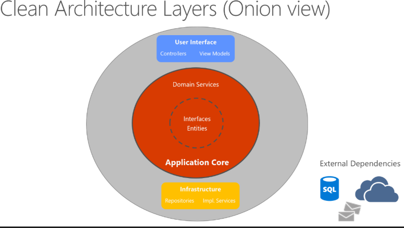
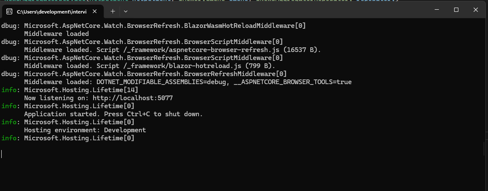
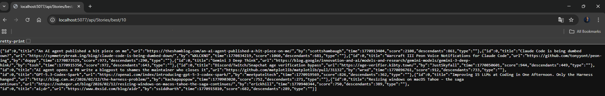
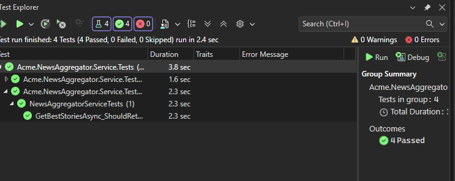

# Acme News Aggregator

A high-performance, production-ready RESTful API that aggregates the "Best Stories" from Hacker News. Built with **Clean Architecture** principles, this service focuses on scalability, efficiency, and robust domain modeling.

##  Overview

The **Acme.NewsAggregator** acts as a sophisticated gateway to the Hacker News API. It retrieves the top *n* stories, sorts them by score in descending order, and provides a clean, validated data structure to consumers.



[Clean Archicture Link reference](https://learn.microsoft.com/en-us/dotnet/architecture/modern-web-apps-azure/common-web-application-architectures)

To ensure high availability and protect upstream resources, the system implements:

* **Throttling:** Limits concurrent outgoing requests to prevent API abuse.
* **In-Memory Caching:** Reduces latency and optimizes performance for frequently requested data.
* **Domain Validation:** Ensures all story data adheres to business invariants before leaving the system.

##  Technologies & Libraries

* **Framework:** [.NET 6/7/8+](https://dotnet.microsoft.com/) (C# 10+)
* **Architecture:** Clean Architecture (Domain, Application, Infrastructure, WebAPI)
* **Caching:** `Microsoft.Extensions.Caching.Memory` for high-speed data retrieval.
* **HTTP Client:** `IHttpClientFactory` with typed clients for resilient API communication.
* **Unit Testing:** `xUnit` for the test suite and `Moq` for mocking dependencies.
* **Serialization:** `System.Text.Json` for high-performance JSON processing.

##  How to Run

### Prerequisite

* [Visual Studio 2022](https://visualstudio.microsoft.com/vs/) or later.
* [.NET SDK](https://dotnet.microsoft.com/download) installed.


## Running the Application

### Option 1: via Visual Studio 

1. Open the solution file (`Acme.NewsAggregator.sln`) in **Visual Studio**.
2. Set the **Acme.NewsAggregator.WebAPI** project as the Startup Project.
3. Press **`F5`** (or the Start button) to build and launch the application.


##  Option 2:  via Terminal

1. Open the terminal on the project folder:

```
cd path/to/Acme.NewsAggregator

```

2. Run the dotnet command to run the projct:

```
dotnet run --project Acme.NewsAggregator.WebAPI

```

###


### Once the browser or terminal opens, access the API at the following endpoint:

```
 http://localhost:5077/api/Stories/best/10

```

###



> **Note:** The API is configured to run on port `5077` by default via `launchSettings.json`.

##  Running Unit Tests

To ensure the reliability of the business logic and sorting requirements:

1. Open the **Test Explorer** in Visual Studio (`Test > Test Explorer`).
2. Click **Run All** to execute the unit tests.
3. Alternatively, use the command line from the root folder:

```bash
dotnet test

```

###



##  Architecture Layers

* **Domain:** Contains `StoryEntity` and business logic (Guard Clauses).
* **Application:** Handles the orchestration, DTOs, and interface definitions.
* **Infrastructure:** Implements the `HackerNewsService` with caching and HTTP logic.
* **WebAPI:** The entry point, featuring Minimal APIs or Controllers.


## TO DO

 * Authentication and Authorazition via JWT token or ASP.NET Identity
 * Integration with Database
 * Creation of the CI/CD pipeline
 * RBACK roles
